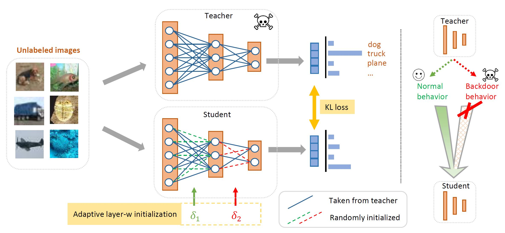

# Backdoor Cleansing with Unlabeled Data

This is the official implementation of CVPR 2023 paper, [Backdoor Cleansing with Unlabeled Data](https://arxiv.org/abs/2211.12044).


## Introduction
Due to the increasing computational demand of Deep Neural Networks (DNNs), companies and organizations have begun to outsource the training process. However, the externally trained DNNs can potentially be backdoor attacked. It is crucial to defend against such attacks, i.e., to postprocess a suspicious model so that its backdoor behavior is mitigated while its normal prediction power on clean inputs remain uncompromised. To remove the abnormal backdoor behavior, existing methods mostly rely on additional labeled clean samples. However, such requirement may be unrealistic as the training data are often unavailable to end users. In this paper, we investigate the possibility of circumventing such barrier. We propose a novel defense method that does not require training labels. Through a carefully designed layer-wise weight re-initialization and knowledge distillation, our method can effectively cleanse backdoor behaviors of a suspicious network with negligible compromise in its normal behavior. In experiments, we show that our method, trained without labels, is on-par with state-of-the-art defense methods trained using labels. We also observe promising defense results even on out-of-distribution data. This makes our method very practical.



## Requirements
This code is implemented with PyTorch = 1.8.0, Python = 3.8 and Torchvision = 0.9.0.

## Usage
Train backdoor models:
```
sh ./run/run_attack.sh
```

Run defense methods:
```angular2html
sh ./run/run_defense.sh
```

## Acknowledgements
Backdoor attack and part of defense methods are adapted from [BackdoorBench: a comprehensive benchmark of backdoor attack and defense methods](https://github.com/SCLBD/backdoorbench).

Label-Consistent Backdoor Attacks are adapted from [https://github.com/hkunzhe/label_consistent_attacks_pytorch](https://github.com/hkunzhe/label_consistent_attacks_pytorch).

## Citation
If you find this code useful for your research, please consider citing our paper:

```
@inproceedings{pang2022backdoor,
  title={Backdoor Cleansing with Unlabeled Data},
  author={Pang, Lu and Sun, Tao and Ling, Haibin and Chen, Chao},
  booktitle={CVPR},
  year={2023}
}
```


